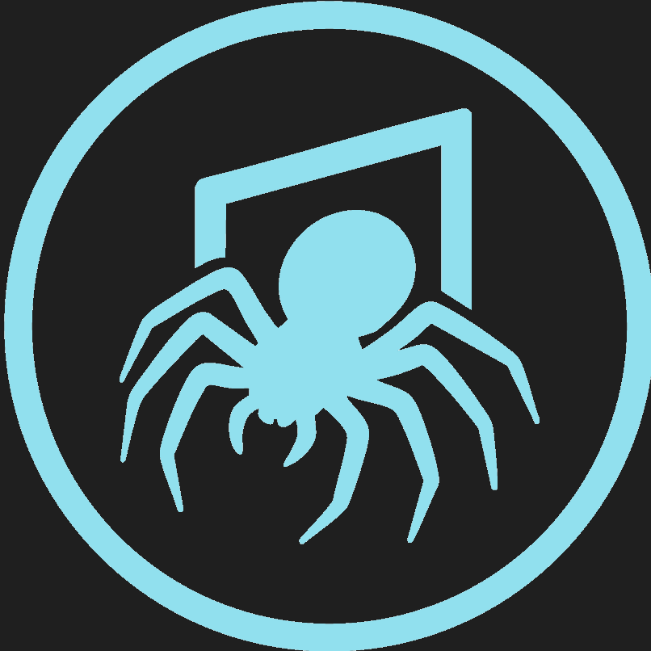

# Trapdoor Security Blog



> Cybersecurity insights, offensive security tutorials, and technical deep-dives.

**Live Site**: [trapdoorsec.com](https://trapdoorsec.com)
**YouTube**: [@trapdoorsec](https://youtube.com/@trapdoorsec)
**Handbook**: [handbook.trapdoorsec.com](https://handbook.trapdoorsec.com)
---


---

## 🕷️ About This Blog

The Trapdoor Security blog is where I share cybersecurity research, offensive security techniques, CTF walkthroughs, and industry insights. Every system has a hidden entrance - this blog explores how to find them (and how to defend against those who do).

### What You'll Find Here

- 🔍 **Penetration Testing Tutorials** - Hands-on offensive security techniques
- 🎯 **CTF Walkthroughs** - HackTheBox, TryHackMe, and CTF writeups
- 🛡️ **Security Analysis** - Vulnerability research and CVE breakdowns
- 📰 **Industry Commentary** - Thoughts on cybersecurity trends and news
- 🔧 **Tool Reviews** - Testing and reviewing security tools
- 💻 **Lab Setups** - Building effective security testing environments

---

## 📝 Recent Posts
[View all posts →](https://trapdoorsec.com/blog)

---

## 🏗️ Built With

This blog is built using:
- **[Zola](https://getzola.org/)** - Static site generator
- **Markdown** - Content format
- **Custom Theme based on [tabi](https://www.getzola.org/themes/tabi/)**
- **Digital Ocean** - Hosting

## 🚀 Local Development

### Prerequisites
- [Zola](https://getzola.org/) (or your chosen SSG)
- Git

### Setup

```bash
# Clone the repository
git clone https://github.com/trapdoorsec/blog.git
cd blog

# Start local development server
zola serve

# View at http://localhost:1111
```

---

## 🤝 Contributing

While this is a personal blog, contributions are welcome for:
- 🐛 Typo fixes and corrections
- 📝 Technical accuracy improvements
- 🎨 Theme improvements
- 💡 Suggestions via issues

### How to Contribute

1. Fork the repository
2. Create a feature branch (`git checkout -b fix/typo-correction`)
3. Make your changes
4. Test locally (`zola serve`)
5. Commit and push
6. Open a Pull Request

**Note**: New blog posts are typically authored by James. For guest posts, please reach out first.

---

## 📧 Contact & Collaboration

Interested in:
- 🎤 **Guest posts** - Reach out with your idea
- 🤝 **Collaboration** - Security research projects
- 📺 **Interviews** - For podcasts or videos
- 💼 **Professional inquiries** - Consulting or training

**Contact**: [trapdoorsec-offical@pm.me](mailto:trapdoorsec-offical@pm.me)
**LinkedIn**: [James Burger](https://linkedin.com/in/jamesburger79)

---

## 🔗 Related Projects

- 📚 **[Trapdoor Security Handbook](https://github.com/trapdoorsec/handbook)** - Comprehensive offensive security guide
- 🎥 **[YouTube Channel](https://youtube.com/@trapdoorsec)** - Video tutorials and walkthroughs

---

## 📊 Analytics & Privacy

This blog respects your privacy:
- ✅ No tracking cookies
- ✅ No third-party analytics
- ✅ Minimal logging (server access logs only)
- ✅ No ads or monetization
---

## 📜 License

### Blog Content
- **Blog posts and articles**: © 2024-2025 James Burger - All Rights Reserved
- **Code snippets**: MIT License (use freely with attribution)
- **CTF writeups**: Educational use only

### Theme & Code
- MIT License - see [LICENSE](LICENSE) file
---

## 🙏 Acknowledgments

Inspired by amazing security blogs:
- [Krebs on Security](https://krebsonsecurity.com/)
- [Trail of Bits Blog](https://blog.trailofbits.com/)
- [Project Zero](https://googleprojectzero.blogspot.com/)
- [IppSec](https://ippsec.rocks/)
- [0xdf hacks stuff](https://0xdf.gitlab.io/)

---

## ⭐ Support

If you find the content valuable:
- ⭐ Star this repository
- 🔄 Share posts on social media
- 📺 Subscribe to the [YouTube channel](https://youtube.com/@trapdoorsec)
- 💬 Engage with comments and discussions

---

**Find the trapdoor. Learn offensive security.**

*© 2024-2025 Trapdoor Security | Built with [Zola](https://getzola.org/)*
